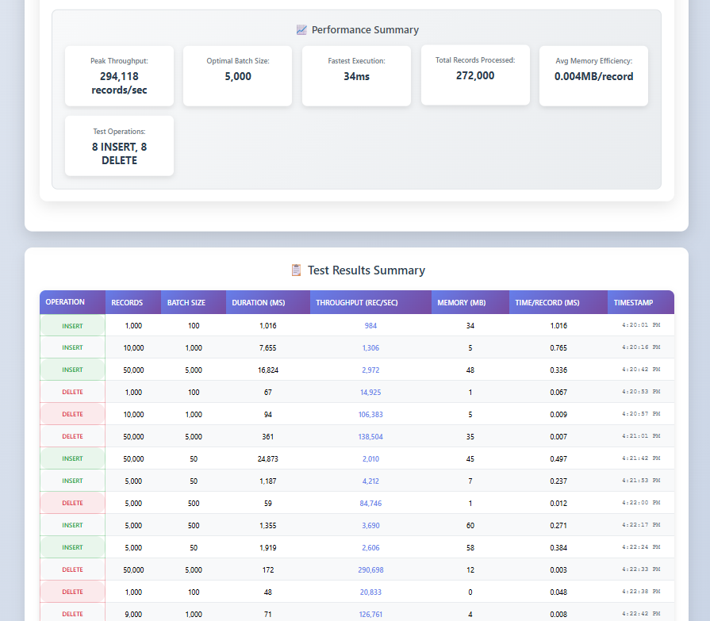
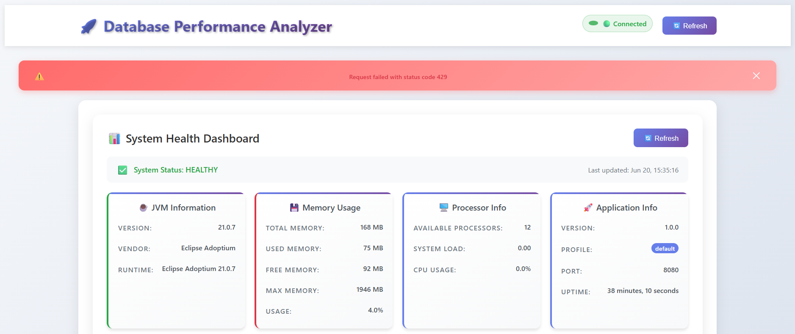
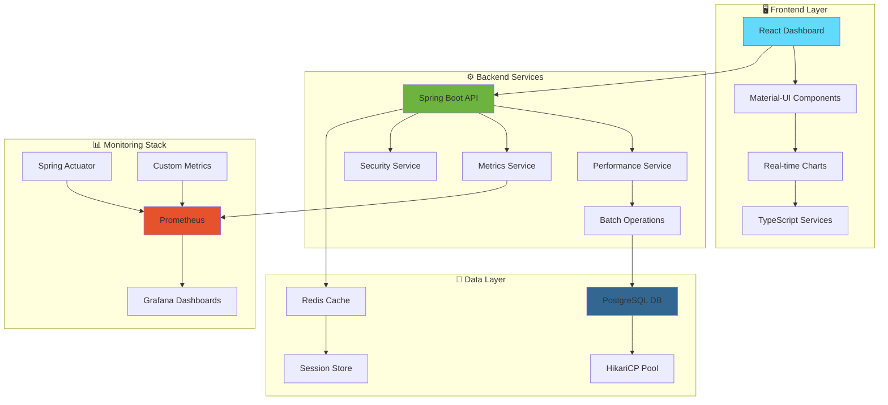

# 🚀 Database Batch Performance Analyzer

> **A comprehensive Spring Boot application for analyzing and visualizing database batch operation performance with real-time monitoring and interactive dashboards.**

[](https://openjdk.java.net/projects/jdk/21/)
[](https://spring.io/projects/spring-boot)
[](https://reactjs.org/)
[](https://www.typescriptlang.org/)
[](https://docs.docker.com/compose/)
[](https://www.postgresql.org/)
[](LICENSE)

## 📸 Project Screenshots

📸 Application Showcase
🎯 Main Dashboard
<div style="display: flex; width: 100%; justify-content: space-between; align-items: center; gap: 16px;">
  
  
  
</div>
<div align="center">
  <p><em>Interactive dashboard with real-time performance analytics and comprehensive metrics visualization</em></p>
</div>

📊 Advanced Analytics
<div style="display: flex; width: 100%; justify-content: space-between; align-items: center; gap: 16px;">
  
  
  
</div>
<div align="center">
  <p><em>Detailed performance charts showing batch vs single operation comparisons and resource utilization</em></p>
</div>

🔌 API Integration
<div style="display: flex; width: 100%; justify-content: space-between; align-items: center; gap: 16px;">
  
  
  
</div>
<div align="center">
  <p><em>RESTful API endpoints with comprehensive testing capabilities and security features</em></p>
</div>

📈 Production Monitoring
<div style="display: flex; width: 100%; justify-content: space-between; align-items: center; gap: 16px;">
  
  
</div>
<div style="display: flex; width: 100%; justify-content: space-between; align-items: center; gap: 16px; margin-top: 16px;">
  
  
  
</div>
<div align="center">
  <p><em>Enterprise-grade monitoring with Prometheus metrics collection and Grafana visualization dashboards</em></p>
</div>

⚡ Performance Benchmarks
<div style="display: flex; width: 100%; justify-content: center; align-items: center; gap: 16px;">
  
</div>
<div align="center">
  <p><em>Comprehensive performance analysis showing throughput improvements with optimized batch operations</em></p>
</div>

---

🌟 Key Features
<table>
<tr>
<td width="50%">
🎯 Core Performance Testing

Batch vs Single Operations - Compare performance with different batch sizes
Real-time Metrics - Live monitoring of execution time and throughput
Memory Optimization - Track heap usage and garbage collection
Connection Pooling - Optimized HikariCP configuration

</td>
<td width="50%">
📊 Advanced Analytics

Interactive Dashboard - Modern React-based UI with real-time charts
Performance Insights - Detailed analysis of throughput and latency
Historical Data - Track performance trends over time
Comparative Analysis - Side-by-side batch configuration comparison

</td>
</tr>
<tr>
<td>
🔐 Enterprise Security

Role-based Authentication - Admin and viewer roles
Secure Configuration - Environment-based management
API Security - Protected endpoints with Spring Security
Audit Logging - Comprehensive security logging

</td>
<td>
🐳 Production-Ready

Multi-Environment Support - Dev, staging, and production configs
Docker Containerization - Complete containerized setup
Monitoring Stack - Integrated Prometheus + Grafana
Health Checks - Comprehensive monitoring and alerting

</td>
</tr>
</table>
---

## 🏗️ Architecture Overview



---

🚀 Quick Start Guide
📋 Prerequisites
<table>
<tr>
<td align="center"><br/><strong>Java 21+</strong></td>
<td align="center"><br/><strong>Node.js 18+</strong></td>
<td align="center"><br/><strong>Docker</strong></td>
<td align="center"><br/><strong>Maven 3.8+</strong></td>
</tr>
</table>
🔧 Installation Steps
1️⃣ Clone Repository
bashgit clone https://github.com/mrvivekthumar/batch-performance-analyzer.git
cd batch-performance-analyzer
2️⃣ Environment Setup
bash# Copy and configure environment files
cp Docker/.env.template Docker/.env
cp Docker/.env.prod.template Docker/.env.prod

# ⚠️ IMPORTANT: Edit with your secure passwords
nano Docker/.env
3️⃣ Docker Deployment (Recommended)
bashcd Docker
docker-compose up -d

# View application logs
docker-compose logs -f app
4️⃣ Alternative: Local Development
bash# Backend
mvn clean compile
mvn spring-boot:run -Dspring-boot.run.profiles=dev

# Frontend (new terminal)
cd client
npm install && npm start
🌐 Access Points
<div align="center">
🖥️ Service🔗 URL🔐 CredentialsMain Dashboardhttp://localhost:8080admin / your-passwordGrafana Monitoringhttp://localhost:3000admin / grafana-passwordPrometheus Metricshttp://localhost:9090No authenticationAPI Health Checkhttp://localhost:8080/actuator/healthPublic endpoint
</div>

---

### 🎯 Performance Testing Workflow

📊 Performance Testing Guide
🎯 Testing Workflow
<div align="center">
  
</div>
Step 1: Initialize Test Data
bash# Via Dashboard UI
1. Navigate to main dashboard
2. Set total records (e.g., 1,000)
3. Choose batch size (1 = single, 100 = batch)
4. Click "📝 INSERT Test"

# Via REST API
curl -X POST "http://localhost:8080/api/v1/performance/initialize?totalRecords=1000&batchSize=100" \
  -u admin:your-password
Step 2: Run Performance Tests
bash# Deletion Test via API
curl -X POST "http://localhost:8080/api/v1/performance/delete?totalRecords=1000&batchSize=100" \
  -u admin:your-password
📈 Performance Benchmarks
<div align="center">
🧪 Test Scenario📝 Records📦 Batch Size⚡ Throughput💾 Memory UsageSingle Insert1,0001~50 records/secHigh per recordBatch Insert1,000100~2,000 records/secOptimizedSingle Delete1,0001~30 records/secIndividual queriesBatch Delete1,000100~1,500 records/secBulk operationsLarge Batch10,0001,000~5,000 records/secMemory efficient
</div>
📊 Key Performance Insights
<table>
<tr>
<td width="33%" align="center">
<strong>🚀 Throughput Analysis</strong><br/>
<code>Single: 10-50 rec/sec</code><br/>
<code>Batch: 1K-5K rec/sec</code><br/>
<code>Optimal: 100-500 batch size</code>
</td>
<td width="33%" align="center">
<strong>💾 Resource Usage</strong><br/>
<code>Memory: 10-50MB/10K records</code><br/>
<code>CPU: 15-40% during ops</code><br/>
<code>Connections: 5-20 active</code>
</td>
<td width="33%" align="center">
<strong>⚡ Performance Gain</strong><br/>
<code>Batch vs Single: 90%+ faster</code><br/>
<code>Memory efficiency: 60% better</code><br/>
<code>Connection usage: 70% reduced</code>
</td>
</tr>
</table>

---

## 🔧 Configuration & Technology Stack
🔧 Configuration & Technology Stack
⚙️ Technology Stack
<div align="center">
Backend Stack
<table>
<tr>
<td align="center"><br/><strong>Spring Boot 3.5</strong></td>
<td align="center"><br/><strong>PostgreSQL 16</strong></td>
<td align="center"><br/><strong>Redis</strong></td>
<td align="center"><br/><strong>Prometheus</strong></td>
</tr>
</table>
Frontend Stack
<table>
<tr>
<td align="center"><br/><strong>React 19</strong></td>
<td align="center"><br/><strong>TypeScript 5.7</strong></td>
<td align="center"><br/><strong>Material-UI</strong></td>
<td align="center">📊<br/><strong>Recharts</strong></td>
</tr>
</table>
DevOps & Monitoring
<table>
<tr>
<td align="center"><br/><strong>Docker</strong></td>
<td align="center"><br/><strong>Grafana</strong></td>
<td align="center"><br/><strong>Maven</strong></td>
<td align="center">🔧<br/><strong>Spring Actuator</strong></td>
</tr>
</table>
</div>
🌍 Environment Configuration
<div align="center">
🏷️ Environment📝 Profile🗄️ Database📊 Monitoring🔐 SecurityDevelopmentdevLocal PostgreSQLBasic loggingRelaxedDockerdockerContainer DBPrometheusStandardProductionprodExternal DBFull monitoringStrict
</div>

---

## 📈 API Documentation

### Core Performance Endpoints

#### Initialize Performance Test
```http
POST /api/performance/initialize
Parameters:
  - totalRecords: int (number of records to insert)
  - batchSize: int (batch size for operations)
  
Response:
{
  "executionTime": 1250,
  "recordsProcessed": 1000,
  "throughput": 800.0,
  "memoryUsed": 45.2
}
```

#### Delete Performance Test
```http
POST /api/performance/delete
Parameters:
  - totalRecords: int (number of records to delete)
  - batchSize: int (batch size for operations)
```

#### System Statistics
```http
GET /api/performance/stats/system
Response:
{
  "cpuUsage": 15.4,
  "memoryUsage": 68.2,
  "activeConnections": 12,
  "totalRequests": 1523
}
```

#### Database Statistics
```http
GET /api/performance/stats/database
Response:
{
  "totalRecords": 50000,
  "connectionPoolSize": 20,
  "activeConnections": 5,
  "queryExecutionTime": 12.4
}
```

### Monitoring Endpoints

```bash
# Application health
GET /actuator/health

# Prometheus metrics
GET /actuator/prometheus

# JVM metrics
GET /actuator/metrics

# Application info
GET /actuator/info
```

---

## 🏛️ Technology Stack

### **Backend Technologies**
- **Spring Boot 3.5.0** - Main application framework
- **Spring Data JPA** - Database operations and ORM
- **Spring Security** - Authentication and authorization
- **HikariCP** - High-performance connection pooling
- **Micrometer** - Application metrics collection
- **PostgreSQL 16** - Primary database
- **Redis** - Caching and session management

### **Frontend Technologies**
- **React 19.0.0** - Modern UI framework
- **TypeScript 5.7.2** - Type-safe JavaScript
- **Material-UI 6.3.0** - Component library
- **Recharts 2.13.3** - Interactive data visualization
- **React Query** - Data fetching and state management
- **Axios** - HTTP client for API calls

### **Monitoring & DevOps**
- **Prometheus** - Metrics storage and alerting
- **Grafana** - Advanced data visualization and dashboards
- **Docker Compose** - Multi-container deployment
- **Spring Boot Actuator** - Production monitoring endpoints
- **Maven** - Build automation and dependency management

### **Development Tools**
- **JMH (Java Microbenchmark Harness)** - Performance benchmarking
- **Logback** - Structured logging
- **JUnit 5** - Unit testing framework
- **Testcontainers** - Integration testing with containers

---

## 📊 Performance Insights & Benchmarks

### Typical Performance Results

#### **Throughput Analysis**
- **Single Operations**: 10-50 records/second
- **Small Batches (10-50)**: 200-800 records/second  
- **Optimal Batches (100-500)**: 1,000-5,000 records/second
- **Large Batches (1000+)**: 3,000-8,000 records/second

#### **Resource Utilization**
- **Memory Usage**: 10-50MB per 10K records (varies by batch size)
- **CPU Usage**: 15-40% during active operations
- **Database Connections**: 5-20 active connections (optimal pool size: 20-50)
- **Performance Improvement**: 90%+ with proper batching vs single operations

### Key Metrics Tracked

| Metric Category | Specific Metrics | Purpose |
|----------------|------------------|---------|
| **Execution Performance** | Total time, throughput, latency | Measure operation efficiency |
| **Resource Usage** | Heap memory, CPU utilization, GC time | Monitor system impact |
| **Database Performance** | Connection pool usage, query time | Optimize database operations |
| **Application Health** | Error rates, response times | Ensure system stability |

---

📁 Project Structure
<details>
<summary><strong>📂 Click to expand project structure</strong></summary>
batch-performance-analyzer/
├── 📁 src/main/java/com/vivek/           # 🌟 Backend source code
│   ├── 📁 config/                        # ⚙️ Configuration classes
│   │   ├── 📄 DatabaseConfig.java        # 🗄️ Database & connection pooling
│   │   ├── 📄 SecurityConfig.java        # 🔐 Security & authentication
│   │   └── 📄 RetryConfig.java           # 🔄 Retry mechanisms
│   ├── 📁 controller/                    # 🎮 REST API controllers
│   │   └── 📄 PerformanceTestController.java
│   ├── 📁 service/                       # 🔧 Business logic services
│   │   └── 📄 PerformanceTestService.java
│   ├── 📁 model/                         # 📊 JPA entities
│   │   └── 📄 PerformanceTestRecord.java
│   ├── 📁 repository/                    # 💾 Data access layer
│   │   └── 📄 PerformanceTestRepository.java
│   ├── 📁 metrics/                       # 📈 Custom metrics
│   │   └── 📄 ApplicationMetrics.java
│   └── 📁 exception/                     # ⚠️ Error handling
│       └── 📄 GlobalExceptionHandler.java
├── 📁 src/main/resources/                # 📋 Application resources
│   ├── 📄 application.yml                # ⚙️ Main configuration
│   ├── 📄 application-dev.yml            # 🛠️ Development config
│   ├── 📄 application-docker.yml         # 🐳 Docker config
│   ├── 📄 application-prod.yml           # 🏭 Production config
│   └── 📁 static/                        # 🌐 Static web assets
│       └── 📄 index.html                 # 📱 Frontend dashboard
├── 📁 Docker/                            # 🐳 Docker configuration
│   ├── 📄 docker-compose.yml             # 🛠️ Development setup
│   ├── 📄 docker-compose.prod.yml        # 🏭 Production setup
│   ├── 📄 Dockerfile                     # 📦 Application container
│   ├── 📄 .env.template                  # 📝 Environment template
│   ├── 📁 scripts/                       # 🚀 Deployment scripts
│   │   ├── 📄 deploy-prod.sh             # 🏭 Production deployment
│   │   └── 📄 docker-entrypoint.sh       # 🎬 Container startup
│   ├── 📁 prometheus/                    # 📊 Monitoring config
│   │   ├── 📄 prometheus.yml             # 📈 Metrics collection
│   │   └── 📄 alerts-prod.yml            # 🚨 Production alerts
│   └── 📁 grafana/                       # 📊 Dashboard config
│       └── 📁 provisioning/              # ⚙️ Auto-provisioning
├── 📁 docs/                              # 📚 Documentation
│   ├── 📁 images/                        # 🖼️ Screenshots & diagrams
│   │   ├── 📁 dashboard/                 # 🎯 Dashboard screenshots
│   │   ├── 📁 api/                       # 🔌 API documentation images
│   │   ├── 📁 monitoring/                # 📊 Monitoring screenshots
│   │   └── 📁 performance/               # ⚡ Performance charts
│   ├── 📄 API.md                         # 📡 API documentation
│   └── 📄 DEPLOYMENT.md                  # 🚀 Deployment guide
├── 📄 README.md                          # 📖 This documentation
├── 📄 pom.xml                            # 📦 Maven configuration
└── 📄 .gitignore                         # 🚫 Git ignore rules
</details>
```

### 📸 Screenshots Location

**Create this folder structure for your images:**

```bash
mkdir -p docs/images
```

**Recommended image placement:**
- `docs/images/dashboard` - Main dashboard screenshot
- `docs/images/performance` - Analytics charts
- `docs/images/grafana-monitoring` - Grafana dashboards
- `docs/images/api-testing` - API testing examples

**Image guidelines:**
- **Size**: 1200x800px or 16:9 aspect ratio
- **Format**: PNG for screenshots, JPG for photos
- **Quality**: High resolution for clarity
- **Content**: Show key features and real data

---

## 🔍 Troubleshooting

### Common Issues & Solutions

#### **Port Conflicts**
```bash
# Problem: Port 8080 already in use
# Solution: Change application port
echo "server.port=8084" >> src/main/resources/application-local.yml

# Or use environment variable
SERVER_PORT=8084 mvn spring-boot:run
```

#### **Database Connection Issues**
```bash
# Check PostgreSQL status
docker-compose logs postgres

# Test database connection
docker-compose exec postgres psql -U postgres -d performance_db

# Reset database
docker-compose down -v
docker-compose up -d postgres
```

#### **Memory Issues**
```bash
# Increase JVM heap size for large datasets
export JAVA_OPTS="-Xmx4g -Xms2g"
mvn spring-boot:run

# Or in Docker
echo "JAVA_OPTS=-Xmx4g -Xms2g" >> Docker/.env
```

#### **Frontend Build Issues**
```bash
# Clear npm cache and reinstall
cd client
rm -rf node_modules package-lock.json
npm cache clean --force
npm install

# Use specific Node version
nvm use 18
npm install
```

### Performance Optimization Tips

1. **Batch Size Optimization**: Start with 100-500 records per batch
2. **Connection Pool Tuning**: Adjust based on concurrent users
3. **Memory Management**: Monitor heap usage during large operations
4. **Database Indexing**: Ensure proper indexes for performance queries

---

## 🧪 Testing

### Running Tests

```bash
# Backend tests
mvn test

# Frontend tests  
cd client
npm test

# Integration tests with Testcontainers
mvn test -Dtest=*IntegrationTest

# Performance benchmarks
mvn test -Dtest=*BenchmarkTest
```

### Test Coverage

- **Unit Tests**: Service layer and business logic
- **Integration Tests**: Database operations and API endpoints
- **Performance Tests**: Batch operation benchmarks
- **Security Tests**: Authentication and authorization

---

## 🚢 Deployment

### Production Deployment

#### **Docker Production Setup**
```bash
# Copy production environment
cp Docker/.env.prod.template Docker/.env.prod
# Edit with secure production passwords

# Deploy to production
cd Docker
docker-compose -f docker-compose.prod.yml --env-file .env.prod up -d
```

### Environment-Specific Configurations

| Environment | Profile | Database | Monitoring | Security |
|-------------|---------|----------|------------|----------|
| Development | `dev` | Local PostgreSQL | Basic logging | Relaxed |
| Docker | `docker` | Docker PostgreSQL | Prometheus | Standard |
| Production | `prod` | External DB | Full monitoring | Strict |

---

## 🙏 Acknowledgments

- **Spring Boot Team** - For the excellent framework
- **React Community** - For the amazing frontend ecosystem  
- **Prometheus & Grafana** - For powerful monitoring tools
- **PostgreSQL** - For reliable database performance
- **Contributors** - Everyone who helped improve this project

---

## 📞 Support & Contact

- **📧 Email**: mrvivekthumar@gmail.com
- **🐛 Issues**: [GitHub Issues](https://github.com/mrvivekthumar/batch-performance-analyzer/issues)
- **💬 Discussions**: [GitHub Discussions](https://github.com/mrvivekthumar/batch-performance-analyzer/discussions)
---

<div align="center">

**⭐ Star this repository if you find it helpful! ⭐**

Made with ❤️ by [Vivek](https://github.com/mrvivekthumar)

</div>